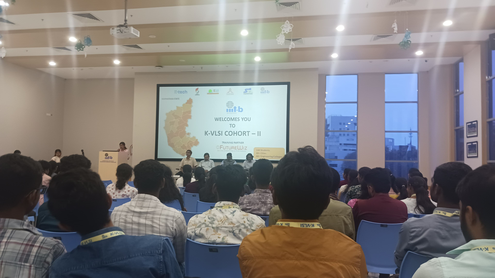
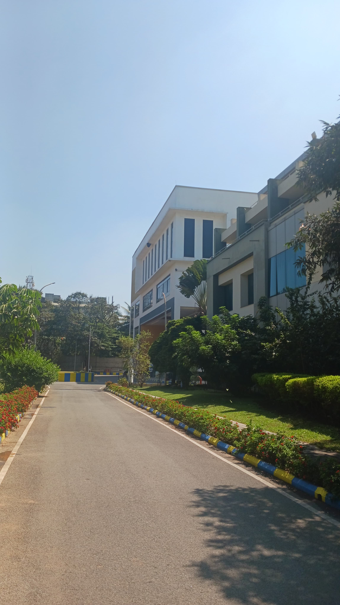
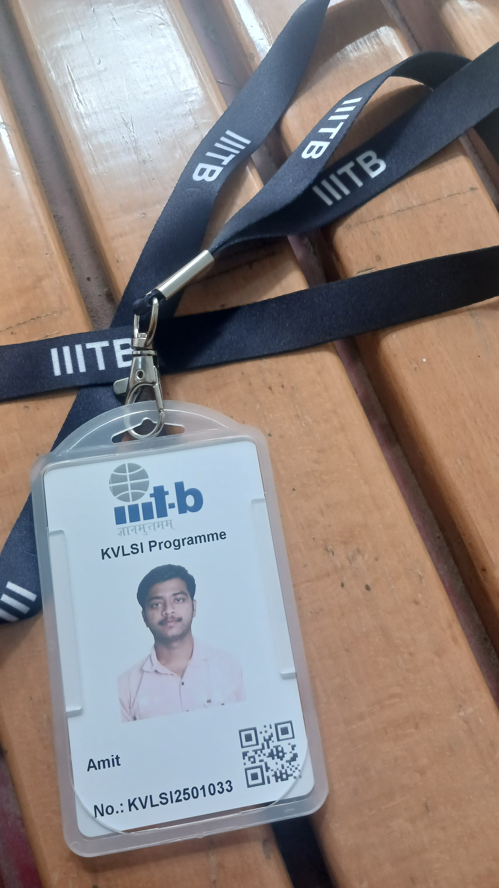

# ✨ amit_kvlsi_iiitb  

Hey there! 👋  
Welcome to my little corner of the VLSI world.

I'm **Amit Suryavanshi**, a **PG Diploma Student at IIIT Bangalore** and currently a **trainee at FutureWiz** (part of **Truechip Solutions** family).  
This repository is **not just a project folder** — it's a **living journal** of my learning journey through **VLSI design**, **verification**, and **embedded systems** 🚀.  

🔗 **[Learn more about the KVLSI Program](https://kvlsi.iiitb.net/)**

---

## 📚 Subjects I've Explored  

Each subject opened a new door into the VLSI universe. Feel free to explore them with me:

| No. | Subject 
|:--|:-------------------------|
| 1. | [Advanced Digital Electronics](https://github.com/amitvsuryavanshi04/amit_kvlsi_iiitb/tree/main/FutureWiz_Daily_Verilog_Codes) ⚡
| 2. | Digital CMOS Technology 🔍
| 3. | Analog CMOS Circuits 🎛️
| 4. | [Functional Verification](https://github.com/amitvsuryavanshi04/amit_kvlsi_iiitb/tree/main/KVLS701-Functional%20Verification%20of%20SoCs) 🔎
| 5. | [High-Level Synthesis](https://github.com/amitvsuryavanshi04/amit_kvlsi_iiitb/tree/main/KVLS602-High%20Level%20Synthesis) 🛠️
| 6. | [Embedded Systems](https://github.com/amitvsuryavanshi04/amit_kvlsi_iiitb/tree/main/KVLS864-Embedded%20Systems%20Design) 📟
| 7. | System Design using Verilog 🧠

*(Click on any subject to dive deeper into my work!)*

---

## 🛠 The KVLSI Program - My Launchpad  

> "**KVLSI**" is more than a course — it's a **mission** initiated by the Government of Karnataka,  
> supported by **MINRO-IIITB**, **SFAL**, **IESA**, and many more visionaries.  
>   
> **Training Partner:** *FutureWiz (Truechip Solutions)*

Through this program, I transitioned from **textbook theories** to **industry-grade VLSI practices**, blending **academia and hands-on** experience beautifully.  
Each module, each lab session, and each project shaped a stronger engineer inside me! 🌱

---

## 📸 Glimpses from the Journey  

Moments that turned into memories:

      

    
    

> *From standing at the gates of IIIT-B to solving real-world VLSI challenges — it's been a ride!* 🎢

---

## 💬 Let's Connect and Grow!  

If you find value here:  
- ⭐ **Give this repo a Star** — it brightens my journey!  
- 💬 **Drop your thoughts** — suggestions, feedback, ideas — I’m all ears!

Together, let's keep learning, building, and pushing the limits of what we can achieve in the VLSI world! 🌟

---

# 🚀 Daily & Consistent improvements can only lead to success !!!
